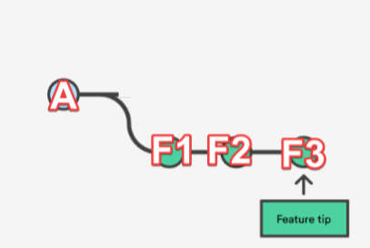
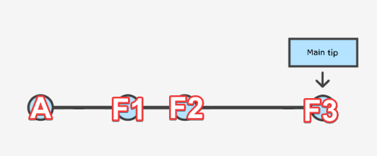
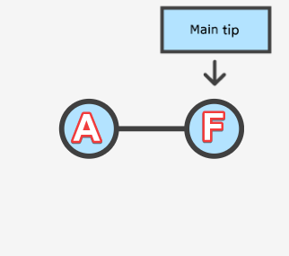
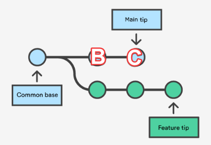
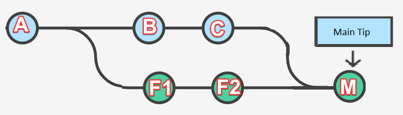
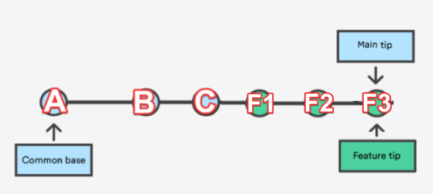

If you follow this it will explain everything you want to know about squash, merge as well as fast forward, and rebase.

## Feature Branches
Say you have **Main** branch at the Origin, with a history of Commits, A.

You pull from **Main**, and create a new branch, **FeatureA**, such that you have commit history:

A, F1, F2, F3 (three commits on **FeatureA** branch)

You want to push you changes into Origin and merge into **Main**. Since **Main** on Origin hasn’t changed you are also able to Fast Forward.

## Merge with Fast Forward

Apply all the commit history of **FeatureA** branch on top of **Main’s** commit history.

## Merge with Squash
An option available whenever your branch has multiple commits is to squash. Squashing combines the history of **FeatureA** branch into a single commit when merging with **Main**.

_Fast forward isn’t possible if there have been other changes on Main._

If you made changes to the **FeatureA** branch, meanwhile others had pushed into **Main**, such that the Origin history of Commits is now: A, B, C

You want to push you changes into **Main** branch on Origin, and you have a few different options:

- Merge (without fast forward)
- Rebase,
- Stash and Pull.

## Merge (aka. Merge without fast-forward)

If you were to fetch a local copy of Origin’s **Main** branch and merge it into your local **FeatureA** branch, you would create a commit for that merge, M. You local history on **FeatureA** would be: A, F1, F2, F3, M, where M is the merge commit.

You could then merge to **Main** (squashing if you wanted). Note that if you don’t squash, you will introduce a Merge commit into the **Main** commit history:

A, B, C, F1, F2, M.

You could avoid this by squashing your branch when merging to **Main**, as described above in the Squash section, resulting in: A B C F, like so:

 with squash")

## Rebase

Rebase is another option to avoid introducing a merge commit into the history. It essentially takes your changes, and makes it **as if you had begun on the latest Main**, rather than on an outdated version of **Main**. For example, after rebasing your Feature branch would branch off from A, B, C, (instead of A, as it was originally). The result:

A, B, C, F1, F2, F3

A, B, C, F (with squash)

_Note, there is no Merge commit, M_

The way Git achieves this is to systematically--commit-by-commit--apply the changes from origin’s **Main** to your branch. The end result is as if you had not started your **FeatureA** branch in the past based off commit A, but as if you started all your changes on top of the latest **Main**.

_The problem is, in the way this is done. For each commit that has to be applied into your **FeatureA** branch, git checks for merge conflicts, and you have to resolve them. If there has been more than one change to **Main** on Origin since your **FeatureA** branch, you can be resolving merge conflicts over and over again._

Perhaps a stash and pull is easier?

## Stash and Pull

Stash your **FeatureA**, Fetch/Pull an up to date local copy of **Main** from Origin, and either create a new branch and apply your stash. (Or merge your new **Main** branch into your branch, and apply your stash. If doing the latter, squash to avoid a merge in the commit history.) Then you can push to Origin / create pull request.

Source: https://stackoverflow.com/a/76709094
